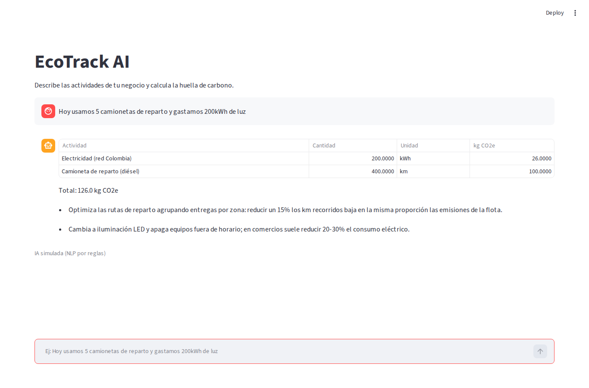
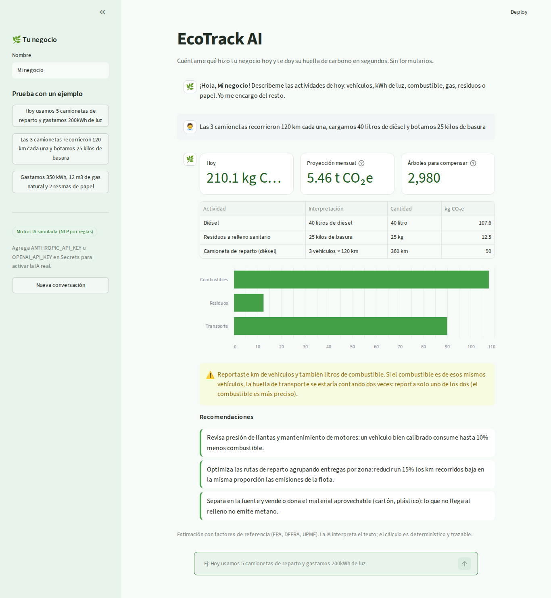
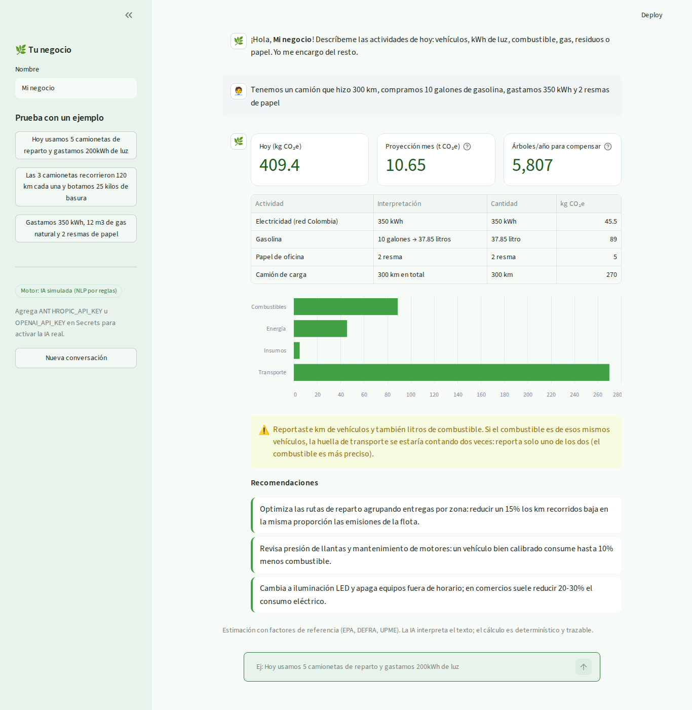

# Bitácora – EcoTrack AI (Capstone Vibe Coding)

**Autor:** David Eduardo Salamanca Aguilar
**Repositorio:** https://github.com/Daxxsb/ecotrack-ai
**Herramientas:** agente de IA con ejecución de código (Claude) para generar, ejecutar, probar y depurar · `.cursorrules` para fijar el contexto del agente · GitHub · Replit (ejecución en la nube).
**Regla del proceso:** yo dirijo con lenguaje natural; la IA escribe, ejecuta y corrige el código. No edité código manualmente.

---

## 1. El "vibe" del producto

- **Usuario:** dueño de un pequeño negocio (panadería, distribuidora, tienda) sin tiempo para formularios.
- **Personalidad:** un asesor cercano y breve que tutea, no usa jerga y siempre termina con acciones concretas.
- **Estética:** minimalista, tonos verdes, mucho espacio en blanco, números grandes y fáciles de leer.
- **Flujo:** escribir → ver impacto en segundos (hoy, mes, árboles) → entender de dónde viene (tabla + gráfico) → saber qué hacer (3 recomendaciones).

## 2. Master Prompt

> Actúa como ingeniero de producto senior. Construye "EcoTrack AI", un MVP web en Python + Streamlit para que dueños de pequeños negocios en Colombia calculen su huella de carbono sin formularios.
> **Entrada:** un chat donde describen su día en lenguaje natural, p. ej. "Hoy usamos 5 camionetas de reparto y gastamos 200kWh de luz".
> **IA:** (1) extrae actividades estructuradas (tipo, cantidad, unidad) con un LLM que responda JSON; si no hay API key, usa un motor por reglas para que la app nunca se caiga; (2) genera 3 recomendaciones de bajo costo priorizando la mayor fuente.
> **Cálculo:** determinístico, cantidad × factor documentado (EPA, DEFRA, red eléctrica colombiana) en un JSON. La IA nunca inventa cifras.
> **Salida:** total del día, proyección mensual, árboles equivalentes, desglose con la interpretación de cada actividad, gráfico por categoría, advertencias de supuestos.
> **Arquitectura:** app.py (UI), core/ai.py, core/calculator.py, data/. Funciones pequeñas, type hints, claves en variables de entorno.
> **Vibe:** minimalista, verde, amable. Debe correr en Replit en el puerto 8080.

## 3. Iteraciones y prompts principales

| # | Prompt (lenguaje natural) | Resultado |
|---|---|---|
| 1 | Master Prompt (arriba) | Estructura modular, factores de emisión, motor de extracción y cálculo. |
| 2 | "Prueba el motor con 4 frases reales de negocio antes de hacer la interfaz y muéstrame el desglose." | Se detectó el bug de doble conteo (sección 5). |
| 3 | "Corrige el error sin romper lo demás y agrega una prueba para que no vuelva a pasar." | Corrección + prueba de regresión. |
| 4 | "Si reportan km de vehículos y también litros de combustible, avisa que puede haber doble conteo." | Advertencias de doble conteo y de supuestos. |
| 5 | "Crea la interfaz tipo chat." | **v1** funcional pero genérica (captura 1). |
| 6 | "Haz el diseño más minimalista y con tonos verdes. Agrega métricas grandes, un gráfico por categoría, ejemplos en la barra lateral y que el historial conserve el análisis completo." | **v2** (captura 2). |
| 7 | "La métrica del total sale cortada y la interpretación muestra texto crudo como '200kwh'. Arréglalo." | **v3** final (capturas 3 y 4). |

## 4. Capturas del proceso

**Captura 1 – v1, primera generación:** funciona (126 kg CO₂e), pero el estilo es el de por defecto, los números salen como "200.0000", no hay gráfico y el historial solo guardaba el total.

**Captura 2 – v2, tras "más minimalista y tonos verdes":** tema verde, métricas, gráfico, barra lateral con ejemplos y advertencia de doble conteo. Todavía se veía "210.1 kg C…" cortado.

**Captura 3 – v3, caso del enunciado:** 126 kg CO₂e hoy · 3,28 t/mes · 1.787 árboles/año.

**Captura 4 – v3, caso completo:** camión, galones de gasolina convertidos a litros, electricidad y papel; 409,4 kg CO₂e.

Las versiones intermedias del código están en `docs/versiones/`.

## 5. Debugging con IA

### Desafío 1: emisiones duplicadas por "camioneta" vs. "camión" (bug real)
- **Síntoma:** con "Hoy usamos 5 camionetas de reparto y gastamos 200kWh de luz" el total era **486 kg CO₂e**. Las camionetas aparecían dos veces: una como *camioneta* y otra como *camión de carga* (`docs/debug_antes.txt`).
- **Cómo lo resolví:** le pasé la salida a la IA y le pedí encontrar la causa. Diagnóstico: el patrón `camion(?:es)?` coincidía con el **prefijo** de "camion-etas". La IA agregó un límite de palabra (`\b`) al patrón de vehículos.
- **Verificación:** el total bajó a **126 kg CO₂e** (5 × 80 km × 0,25 + 200 kWh × 0,13), que es el valor correcto (`docs/debug_despues.txt`). Se agregó `test_camionetas_no_se_cuentan_como_camion`.

### Desafío 2: doble conteo conceptual
Si un negocio reporta "3 camionetas recorrieron 120 km" **y** "cargamos 40 litros de diésel", ambos datos pueden describir el mismo consumo. En vez de adivinar, dirigí a la IA para que la app lo **advierta** y recomiende reportar solo el combustible, que es más preciso.

### Desafío 3: pulido visual
La métrica "126.0 kg CO₂e" se truncaba. Se resolvió describiendo el problema en lenguaje natural: la unidad pasó a la etiqueta y el valor quedó solo con el número.

## 6. Funcionalidad de IA implementada

1. **Extracción de datos de consumo desde texto libre** (`core/ai.py → extract`). Con API key, un LLM (Claude o GPT-4o) recibe la lista de tipos permitidos y devuelve JSON validado. Sin API key corre el modo **IA simulada**, un motor NLP que entiende vehículos con o sin distancia ("cada una"), kWh, litros y galones (con conversión), m³ de gas, kg de residuos y resmas de papel. Si no se dice la distancia, asume 80 km por vehículo y lo marca como supuesto.
2. **Recomendaciones generativas** (`recommend`): el LLM redacta 3 acciones priorizando la categoría con más emisiones; en modo simulado se eligen por impacto.
3. **Principio de diseño:** la IA interpreta y aconseja, pero **no calcula**. Así cada cifra es trazable a un factor con fuente y el resultado no depende de alucinaciones.

**Calidad:** 6 pruebas automatizadas (`python -m pytest -q`), todas pasando.

## 7. Vibe Coding vs. desarrollo tradicional

En un flujo tradicional, este MVP exige diseñar la UI, escribir el parser, buscar factores, maquetar, probar y depurar a mano: varios días. Con Vibe Coding el proceso fue **iterativo y conversacional**: el Master Prompt fijó el contexto completo, y cada mejora fue una instrucción en lenguaje natural. Pasé de la idea a tres versiones probadas en una sola sesión.

El mayor aprendizaje: **la velocidad no reemplaza el criterio**. El bug de las camionetas no lo habría visto si hubiera aceptado la primera versión sin pedir pruebas con casos reales. Mi rol pasó de escribir sintaxis a definir la intención, exigir evidencia (pruebas, capturas, valores esperados) y decidir. La IA ejecuta; yo dirijo y valido.
