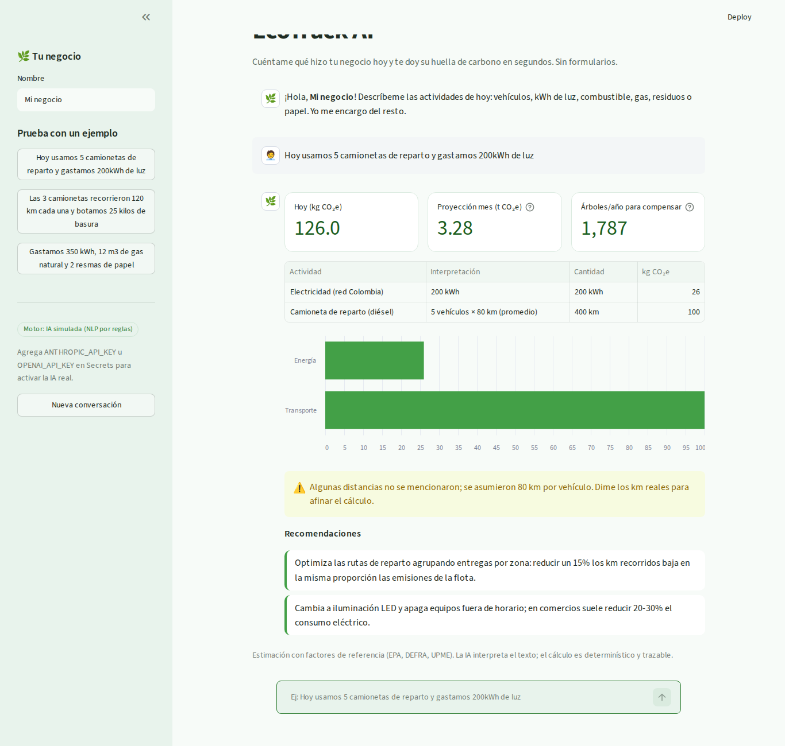

# 🌿 EcoTrack AI

MVP que calcula la huella de carbono de un pequeño negocio a partir de una descripción en lenguaje natural.

> *"Hoy usamos 5 camionetas de reparto y gastamos 200kWh de luz"* → **126 kg CO₂e hoy · 3,28 t/mes · 1.787 árboles/año para compensar**, con desglose, gráfico y recomendaciones.



## Funcionalidad de IA
1. **Extracción** (`core/ai.py → extract`): el texto libre se convierte en actividades estructuradas (tipo, cantidad, unidad, supuestos). Con `ANTHROPIC_API_KEY` u `OPENAI_API_KEY` usa un LLM con salida JSON; sin clave, un motor NLP por reglas (modo simulado).
2. **Recomendaciones** (`recommend`): el LLM redacta 3 acciones de bajo costo priorizando la mayor fuente; en modo simulado se eligen por impacto.

El cálculo (`core/calculator.py`) es determinístico: cantidad × factor (EPA, DEFRA, UPME) en `data/emission_factors.json`.

## Ejecutar
```bash
pip install -r requirements.txt
streamlit run app.py
python -m pytest -q        # 6 pruebas
```
**Replit:** importar este repo y presionar **Run**. Para IA real, agregar la API key en *Secrets*.

## Documentación
- [Bitácora del proceso](BITACORA.md) – master prompt, prompts por iteración, debugging y capturas.
- `.cursorrules` – reglas del agente de IA.
